# System Architecture

The **AI-Driven Scheduling Assistant** operates on a unidirectional data flow architecture, leveraging Serverless functions for logic and an LLM for semantic understanding.

## Data Flow Diagram

```mermaid
sequenceDiagram
    participant User as 👤 User (UI)
    participant Client as 💻 Next.js Client
    participant API as ⚙️ API Route (Controller)
    participant DB as 🗄️ Supabase (State)
    participant AI as 🧠 Groq AI (Llama 3)
    participant Cal as 📅 Google Calendar

    User->>Client: "Move me to 3 PM"
    Client->>API: POST /api/chat {message, studentId}
    
    rect rgb(240, 248, 255)
        note right of API: Context Loading
        API->>DB: Fetch Student Profile & Calendar ID
        DB-->>API: Return Profile
    end

    rect rgb(255, 240, 245)
        note right of API: Semantic Understanding
        API->>AI: Analyze Intent & Extract Entities
        AI-->>API: JSON { intent: "reschedule", time: "15:00" }
    end

    rect rgb(255, 250, 240)
        note right of API: Logic Engine
        API->>Cal: Check Availability (3 PM)
        
        alt Slot is Free
            Cal-->>API: Available
            API->>Cal: Move Event -> 3 PM
        else Slot is Taken (Conflict)
            Cal-->>API: Conflict (Student B)
            note right of API: ⚠️ Smart Swap Algorithm
            API->>Cal: Move Student B -> User's Old Slot
            API->>Cal: Move User -> Student B's Old Slot (3 PM)
        end
    end

    API-->>Client: JSON { response: "Swapped/Moved successfully!" }
    Client->>User: Display Bot Message
```

## Component Breakdown

1.  **Next.js Client**: 
    - Renders the `ChatWindow` and `StudentList`.
    - Manages local state (`useState`) for optimistic UI updates.
    - Communicates with the backend via REST.

2.  **API Route (Controller)**:
    - The central orchestrator.
    - Validates requests.
    - maintain statelessness (fetches necessary context from DB on every request).

3.  **Groq AI (Parser)**:
    - Acts as a reasoning engine, not just a chatbot.
    - Transforms unstructured natural language into structured JSON commands for the backend.

4.  **Google Calendar (External Source)**:
    - The single source of truth for scheduling.
    - Accessed via a Service Account to manage events on behalf of users.

5.  **Supabase (Persistence)**:
    - Stores persistent user data (mapping internal IDs to external Calendar IDs).
    - Logs chat history for context retention.
